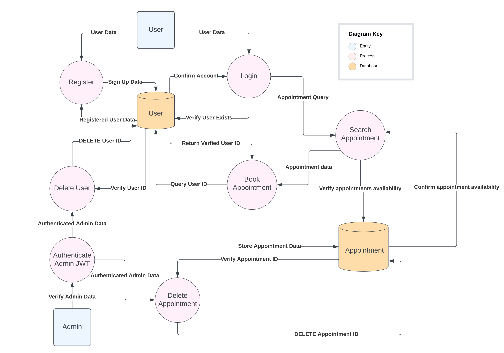
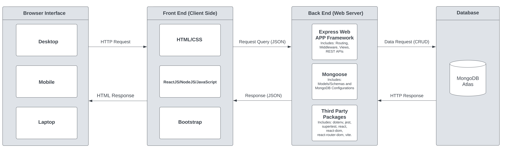
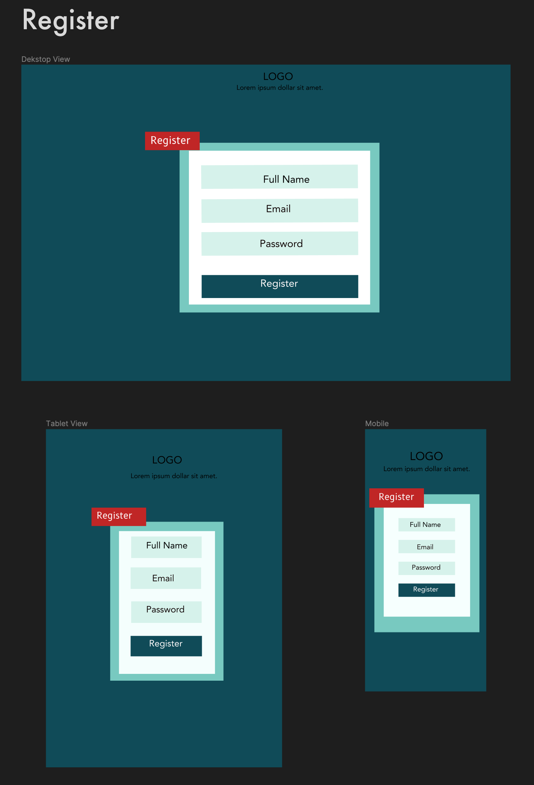
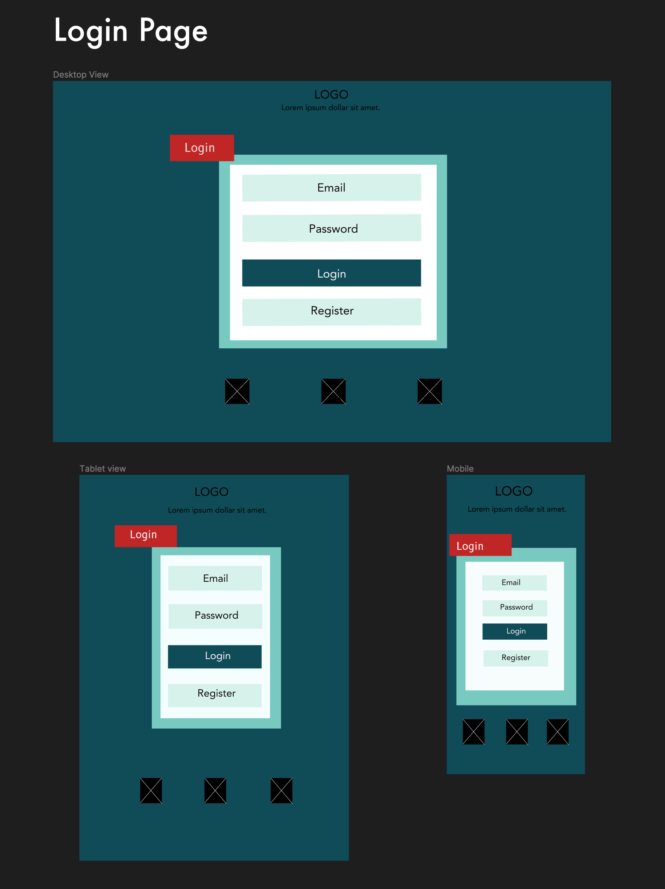
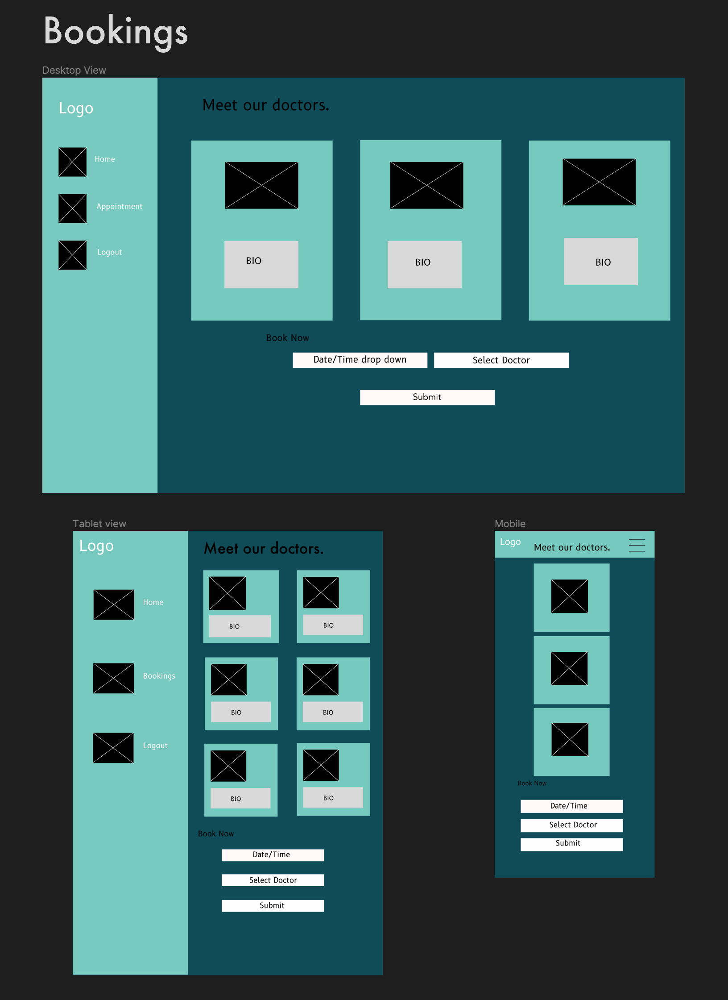
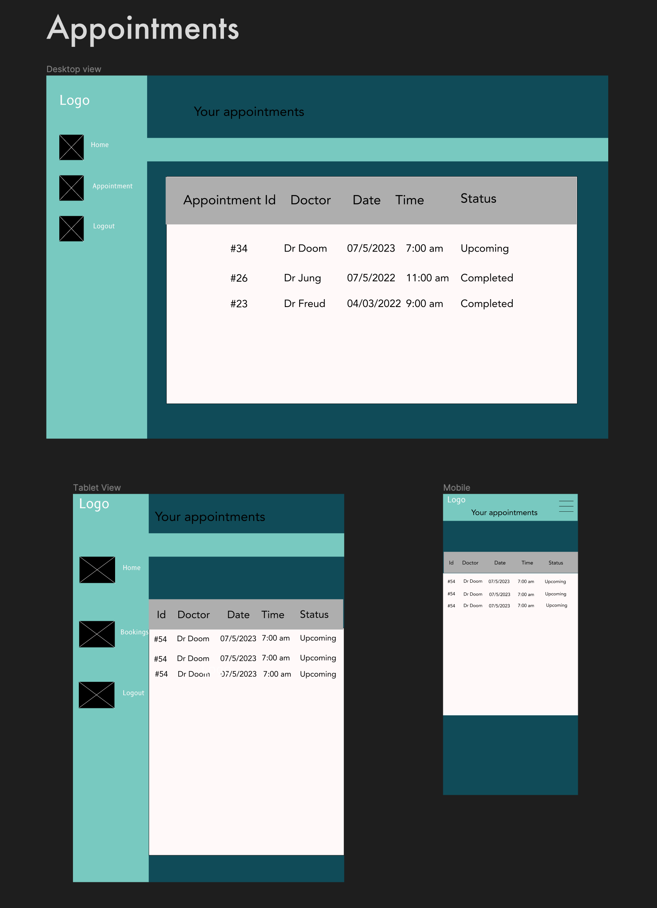

# did this test work? pull req
# WHAT IS HAPPENING HERE? 

# T3A2-A - Full Stack App - Part A

### Erkan Kaban (Student ID - 12980)
### Kamran Ozturk (Student ID - 13013)
### Adam Tunchay (Student ID - 13537)

### WDA2022-02

 

---

## <u>Purpose</u> 

Medi-life is a local doctor’s clinic that has come to our team of developers with a project to create an online booking platform for their patients. In the past, patients must call the clinic and book with the medical receptionist who entered the appointments into their scheduling software. The problem they face is the additional workload this booking system placed on their reception team, and they want to give the patients the ability to book their own appointments without needing to call the surgery during operating hours. 

## <u>Features</u>  

- Patients can register a new account to make a booking 

- Patients and the admin team can log in to the booking site with an existing account 

- Patients can select their preferred Doctor and book an appointment time 

- Appointment times are checked to see if there is an existing booking for that time  

- Patients can view their upcoming appointments 

- Patients can edit and delete their own appointments 

 
## <u>Possible Features</u> 

- Doctors are notified when a patient books an appointment with them 

- Doctors can accept or deny booking requests 

- User account can apply to become a doctor account pending admin’s approval 

## <u>Target Audience</u> 

This application is intended to ease the process of booking appointments at the clinic for both the patients of the clinic as well as the reception/administration team. 

## <u>Tech Stack</u> 

Front-end – React.js, HTML, CSS, Bootstrap, JavaScript 

Back-end – Express.js, Node.js 

Database – MongoDB, Mongoose 

Source Control – Git, GitHub 

Project Management – Trello 

UI/Design – Figma, Lucid Charts 

Testing - Postman, Supertest, Jest-dom, Vitest 

Deployment – Heroku, Netlify 

Project-management tools – Trello, Discord 

## <u>Dataflow Diagram</u>

## <u>Application Architecture Diagram</u>

## <u>User Stories</u>

**Patients**

- As a patient, I want to be able to register a new account, so that I can make a booking.
- As a patient, I want to be able to log in to the booking site with an existing account, so that I can make a booking.
- As a patient, I want to be able to select my preferred Doctor and see their availability, so that I can book an appointment time.
- As a patient, I want to be able to view my upcoming appointments, so that I can keep track of them.
- As a patient, I want to be able to update and delete my own appointments, so that I can change them if I need to.

**Admin**

- As an admin, I want to be able to see all the appointments that have been made, so I can manage the clinic’s schedule.
- As an admin, I want to be able to edit and delete any appointments that have been made, in case a doctor or patient's schedule changes.
- As an admin, I want to be able to delete user accounts, so that our database is clean of incorrect data or accounts that are no longer in use.
- As an admin, I want to be able to see all the users that have registered, so that I can manage the patient's accounts.

## <u>Wireframes</u>

### <u>Register</u>

### <u>Login</u>

### <u>Bookings</u>

### <u>Appointments</u>

## <u>Trello Board</u>
[Trello Link](https://trello.com/invite/b/tHb5bHeE/ATTI7749fd36a62d9a54caf4bc74f064c39a961E7D98/medical-application)

<h2>Week one screenshots</h2>